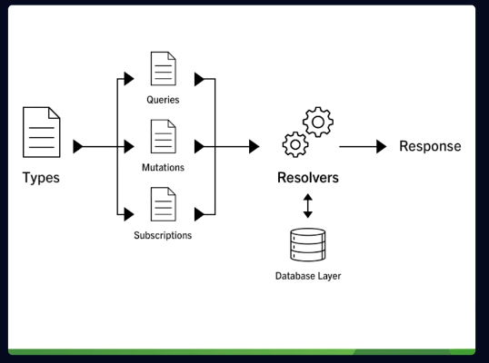

# Install

```sh
npm install
```

# Migrations

```sh
npm run migrations:run
```

# Run in dev mode

```sh
npm run dev
```

# Run in prod mode

```sh
npm run start
```

# GraphQL

store_graphql
npm i apollo-server-express --save

## Type System

On Api/Rest
POST -> create = mutations
GET -> get data = query on graphql
PUT -> update = mutations
DELETE -> remove = mutations

on GRAPHQL all return 201 HTTPS Status code
query -> when we coonsult the data

String


# Graphql Scalar Types

- query
- Int
- Float
- String
- Boolean
- ID

# Graph ql Non-NUll and Lists

- ! -> indicates that the parameter or the response not must be a null
  example:

```js
type Query {
    hello: String!
    getInt(age: Int!): Int
}
```

### Lists

to define lists

```js
type Query {
    getNumbers(numbers: [Int]!): [Int]! // remember ! to not allow nulls outside of array
    getNumbers(numbers: [Int!]!): [Int]! // remember ! to not allow nulls inside of array
}
....
const resolvers = {
    Query: {
        getNumbers: (_, args => ...args.numbers)
    }
}
```

# Object Types and fields

```js
// Type Cannot be a Query, String.. or anothers

type Query {
    getProduct: Product
}

type Product {
    id: ID!
    name: String!
    price: Float!
    description: String
    image: String
    createdAt: String!
}
....
const resolvers = {
    Query: {
        getProduct: () => {
                id: 123!
                name: 'Computer'
                price: 1233
                description: 'Asus Tuf'
                image: 'https://placehorlderimages.com/250x250'
                createdAt: new Date().toISOString
        }
    }
}

....
```
